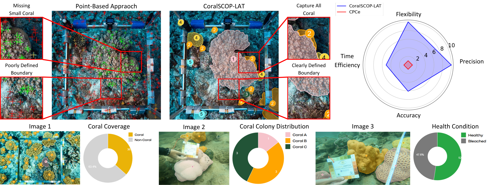

<div align="center">
<h1>CoralSCOP-LAT: Labeling and analyzing tool for coral reef images with dense segmantic mask</h1>

<a href="https://www.sciencedirect.com/science/article/pii/S157495412500411X" target="_blank" rel="noopener noreferrer">

</a>
<a href="https://hkustconnect-my.sharepoint.com/:f:/g/personal/ykwongaq_connect_ust_hk/Eh3ZxkV2c-lIksa4wCYy1YcBCs5PEORfj1saV-3oYsT0tw" target="_blank" rel="noopener noreferrer">

</a> 
<a href="http://coralscop-lat.hkustvgd.com/" target="_blank" rel="noopener noreferrer">

</a>


<br/>

[Yuk-Kwan Wong]()<sup>1</sup>, [Ziqiang Zheng]()<sup>1</sup>, [Mingzhe Zhang]()<sup>1</sup>, [David J. Suggett](https://www.kaust.edu.sa/en/study/faculty/david-suggett)<sup>2,3</sup>, [Sai-Kit Yeung](https://saikit.org/index.html)<sup>1</sup>

<sup>1</sup> Hong Kong University of Science and Technology &nbsp;&nbsp;
<sup>2</sup> King Abdullah University of Science and Technology, Saudi Arabia &nbsp;&nbsp;
<sup>3</sup> University of Technology Sydney, Australia

</div>

## Overview

<p style="text-align: justify;">
CoralSCOP-LAT is a semi-automatic annotation and analysis tool for coral reef imagery, developed to overcome the limitations of traditional point-based methods. Built on the CoralSCOP foundation model, it delivers dense segmentation masks with strong zero-shot generalization across diverse reef sites. The tool streamlines research workflows by providing automatic coral segmentation, customizable labeling, and integrated statistical reporting, enabling efficient, accurate, and flexible large-scale coral reef monitoring and conservation studies.
</p>

<p align="center">
  
</p>

## Project Structure

- **backend/** - FastAPI Python backend with ML models (SAM3, object detection)
- **frontend/** - React + TypeScript frontend with Vite build system

## Prerequisites

- **Backend**: Python 3.8+ with pip
- **Frontend**: Node.js 16+ with npm

## Backend Setup

### 1. Install Dependencies

```bash
cd backend
pip install -r requirements.txt
```

**Note**: The backend has heavy ML dependencies including PyTorch and SAM3. This may take several minutes to install.

### 2. Download Model Checkpoints

Download the [model checkpoints](https://hkust-vgd.nas.ust.hk:5001/sharing/UqZfBF5jF) and extract them into the `backend/checkpoints/` folder.

### 3. Configuration

Edit `backend/config.json` if needed to configure:

- Model checkpoint paths
- Server host/port settings
- Other backend configurations

## Frontend Setup

### 1. Install Dependencies

```bash
cd frontend
npm install
```

### 2. Run Development Server

```bash
npm run dev
```

The frontend will typically start on `http://localhost:5173` and automatically reload on file changes.

### 3. Other Commands

- **Lint**: `npm run lint` - Check code quality
- **Build**: `npm run build` - Create production build (output in `dist/`)
- **Preview**: `npm run preview` - Preview production build locally

## Quick Start

Open **two terminal windows** and run the following:

**Terminal 1 - Backend:**

```bash
cd backend
uvicorn main:app --reload --port 8000
```

**Terminal 2 - Frontend:**

```bash
cd frontend
npm run dev
```

Then open `http://localhost:5173` in your browser. The backend API docs are available at `http://localhost:8000/docs`.

## Troubleshooting

| Issue                   | Solution                                                     |
| ----------------------- | ------------------------------------------------------------ |
| Backend fails to start  | Ensure dependencies are installed: `pip install -r requirements.txt`. Check port 8000 is available. |
| Frontend fails to start | Run `npm install` in `frontend/`. Check port 5173 is available. Node.js 16+ required. |
| Checkpoints not found   | Download checkpoints from the link and extract to `backend/checkpoints/` |
| Port already in use     | Change port in uvicorn command: `--port 9000` (update frontend API calls accordingly) |

## Tech Stack

- **Backend**: Python, FastAPI, PyTorch, SAM3, OpenCV
- **Frontend**: React 19, TypeScript, Vite, React Router, Recharts
## Reference

CoralSCOP-LAT is built on top of the coral segmentation model **[CoralSCOP](https://coralscop.hkustvgd.com/)**.

## Citation

If you find our repository useful, please consider giving it a star ⭐ and citing our paper in your work:

```bibtex
@article{WONG2025103402,
    title = {CoralSCOP-LAT: Labeling and analyzing tool for coral reef images with dense semantic mask},
    journal = {Ecological Informatics},
    volume = {91},
    pages = {103402},
    year = {2025},
    issn = {1574-9541},
    doi = {https://doi.org/10.1016/j.ecoinf.2025.103402},
    url = {https://www.sciencedirect.com/science/article/pii/S157495412500411X},
    author = {Yuk Kwan Wong and Ziqiang Zheng and Mingzhe Zhang and David J. Suggett and Sai-Kit Yeung},
    keywords = {Coral reefs, Coral segmentation, Semi-automatic annotation tool, Machine learning
}
```
